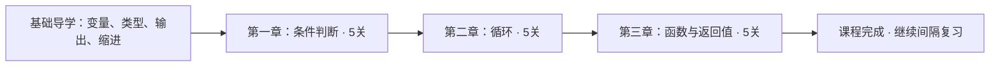

# Python 基础三主题：课程架构与过关规则

## 为什么要增加课程层

之前的前置关系只参与选题，学生看不到整体结构，也缺少练习前的讲解。这次增加真正的课程入口：基础导学 → 知识地图 → 概念学习 → 本关练习 → 过关解锁 → 到期复习。

这里是三主题课程原型，未来还可以添加字符串、列表操作、字典、文件、异常、类等模块；当前不把未实现的章节显示成可学内容。

## 总体路线

| 章节 | 包含知识点 | 本章目标 |
|---|---|---|
| 条件判断 | 比较边界；if/elif；and/or；真假值；独立if | 能解释条件的真假，以及哪些分支会执行 |
| 循环 | range边界；步长；累加；break/continue；while | 能逐轮追踪循环变量、执行路径和最终输出 |
| 函数与返回值 | print/return；return退出；位置参数；局部变量；缺失return | 能区分显示与返回，追踪参数、作用域和不同执行路径 |

## 章内关系

- 条件判断：比较边界 → if/elif → 独立 if；比较边界 → and/or；真假值是本章另一起点。
- 循环：range边界 → 步长、累加、break/continue；while依赖已学过的比较边界。
- 函数：print/return → return退出；位置参数 → 局部变量；return退出与条件分支 → 缺失return。

整章通过后才开启下一章。章内可在满足前置关系的知识点间选择，不要求强行按一条直线学习。

## 每一课提供什么

1. 学习目标：这一课要能解释什么。
2. 前置关系：它建立在哪些概念上。
3. 概念讲解：两段核心规则和适用范围。
4. 示例与输出：独立于现有测验题的例子。
5. 逐步说明：解释示例为什么得到该结果。
6. 思考题：提示读者主动推理，不自动评分。
7. 闯关入口：显式确认已阅读后，进入两题验证。

阅读确认只记录用户点击“我已阅读”，不会把点击或停留时长当成理解证据。

## 过关规则

- 必须完成导学、满足前置关卡、确认本课已阅读。
- 只统计标记为该概念的课程闯关作答，旧记录及自由练习不自动折算。
- 本关两道不同题各自最近一次闯关作答都正确，且 hints_used 为 0，才通过。
- 重复答对同一道题不能替代另一道题；使用提示或答错后，需要重新独立作答。
- 一旦在某个时间点满足过关条件，通关记录保留；后续复习错误会影响近期表现和复习计划，但不重锁后续章节。
- 完成最后一章后，地图显示 15/15 已过关；仍可以点击已过关知识点复习。

原型每概念只有两道题，重新答题可能受到记忆答案的影响。后续应增加未见过的迁移题，再提高过关要求；当前过关不能当作掌握程度的测量工具。

## 实现与数据兼容

- `data/lessons.json`：讲解、示例输出、思考题。
- `edu/curriculum.py`：课程状态纯函数、章节门槛、下一道关卡题。
- `edu/course_ui.py`：知识地图、可预览课程和开始按钮。
- `attempts.course_concept`：区分课程与自由练习，旧数据为NULL。
- `lesson_reads`：首次阅读确认时间，重复点击不新增重复记录。

以作答日志重建已达成过关状态，重启后保留。未来若修改题号或课程标准，应设计课程版本迁移，不能静默改变旧过关规则。

## 验证

41 项自动测试包含 15 课示例输出、顺序解锁、阻止未解锁关卡计分、阅读不直接过关、同题重复不能过关、提示后重做、错误撤销未完成关卡的单题合格状态、重启恢复及通关后不重锁。

桌面验证使用临时数据库，覆盖首页地图 → 导学 → 讲解 → 提示后重试 → 两题独立完成 → 返回地图查看新解锁课程。
